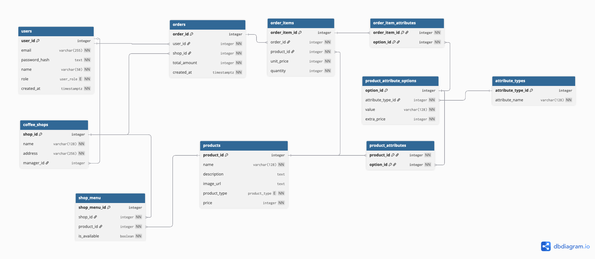

# Описание
Сайт сети кофеен, позволяющий пользователям оформлять заказы, просматривать меню, а администраторам и менеджерам управлять кофейнями и ассортиментом.
## Наименование
**Coffee Shop website** - сайт для сети кофеен
## Предметная область
Предметной областью является поддержка процессов управления сети кофеен, включая ассортимент, просмотр заказов, анализ продаж со стороны администратора и менеджера. Также промотр меню, возможность оформить заказ в определенной точке сети со стороны пользователя. 
# Данные
ER-диаграмма базы данных:

 

## Для каждого элемента данных - ограничения
**Пользователь (User)**

Email является уникальным и обязательным, пароль хранится в виде хэша и обязателен,
имя пользователя обязательно. Роль пользователя строго ограничена допустимыми значениями: customer, manager, admin. Дата создания аккаунта устанавливается автоматически при создании записи.    
Нельзя удалить пользователя, если у него есть связанные заказы.

**Кофейня (CoffeeShop)**

Название и адрес кофейни обязательны.
Каждая кофейня может быть привязана к одному менеджеру.
Связь с менеджером реализована через пользователя с ролью manager.  
При удалении менеджера связь автоматически сбрасывается. Поле manager_id становится NULL.


**Продукт (Product)**

Название продукта обязательно.
Тип продукта ограничен допустимыми значениями: coffee, non_coffee, bakery.
Цена обязательна и не может быть отрицательной.
Описание и изображение являются необязательными.  
Если продукт входит в заказы пользователей, его удалить невозможно.
Продукт нельзя удалить, если он используется в меню кофейни (shop_menu), в заказах (orders).

**Меню кофейни (ShopMenu)**

Связывает кофейню и продукт.
Одна и та же позиция продукта не может быть добавлена в меню одной кофейни более одного раза.
Флаг доступности определяет, может ли продукт быть заказан в данный момент.  
При удалении кофейни все связанные позиции меню удаляются автоматически.


**Заказ (Order)**

Заказ обязательно связан с пользователем и кофейней.
Общая сумма заказа не может быть отрицательной и по умолчанию равна нулю.
Дата создания заказа устанавливается автоматически.  
При удалении заказа все его позиции (order_items) удаляются автоматически.


**Позиция заказа (OrderItem)**

Каждая позиция заказа обязательно привязана к заказу и продукту.
Цена за единицу и количество обязательны.
Количество товара должно быть не меньше 1, цена не может быть отрицательной.

**Тип атрибута (AttributeType)**

Тип атрибута описывает категорию опций продукта (например: размер, тип молока, сироп).
Название типа атрибута обязательно и уникально.


**Опция атрибута продукта (ProductAttributeOption)**

Каждая опция принадлежит определённому типу атрибута.
Значение опции обязательно и уникально в рамках одного типа атрибута.
Дополнительная стоимость не может быть отрицательной.  
При удалении типа атрибута все связанные опции удаляются автоматически.


**Атрибуты продукта (ProductAttributes)**

Связующая таблица между продуктами и доступными для них опциями атрибутов.
Одна и та же опция не может быть привязана к продукту более одного раза.  
При удалении продукта или опции соответствующие связи удаляются автоматически.


**Атрибуты позиции заказа (OrderItemAttributes)**
Хранит выбранные пользователем опции атрибутов для конкретной позиции заказа.
Каждая опция может быть выбрана для позиции заказа только один раз.  
При удалении позиции заказа все выбранные для неё атрибуты удаляются автоматически.

## Общие ограничения целостности
Ограничения целостности данных обеспечиваются внешними ключами. Используютcя уникальные поля для предотвращения дублирования в таблицах. Также используются каскадные и ограничивающие удаления связанных записей.
 
# Пользовательские роли
### Customer (Клиент)

*Назначение роли*

Клиент является конечным пользователем системы. Он взаимодействует с кофейнями сети, просматривает меню, оформляет заказы и отслеживает свою историю покупок.

*Возможности клиента*

- Регистрация и авторизация в системе
- Просмотр списка всех кофеен сети
- Просмотр меню выбранной кофейни
- Просмотр доступных опций и атрибутов продуктов
- Оформление заказа с выбором продуктов и дополнительных опций
- Просмотр истории своих заказов
- Просмотр информации о текущем пользователе

---

### Manager (Менеджер)

*Назначение роли*

У каждой кофейни есть свой менеджер. Менеджер отвечает за работу конкретной кофейни. Он управляет меню своей кофейни, отслеживает заказы и анализирует показатели продаж.

*Возможности менеджера*

- Получение информации о кофейне, к которой он привязан
- Управление меню своей кофейни:
    - просмотр меню
    - добавление продуктов из всей продукции в меню своей кофейни
    - обновление доступности
    - удаление позиций меню
- Просмотр всех заказов своей кофейни
    - Просмотр заказов за текущий день
    - Получение статистики по количеству заказов
- Просмотр аналитики по своей кофейне:
    - продажи и выручка
    - количество заказов
    - популярные продукты
    - распределение заказов по времени суток

---

### Admin (Администратор)

*Назначение роли*

Администратор управляет всей системой в целом. Он отвечает за конфигурацию сети кофеен, пользователей, продуктов и аналитических данных.

*Возможности администратора*
- Управление пользователями:
    - просмотр списка пользователей
    - создание, редактирование и удаление пользователей
- Управление кофейнями:
    - создание и удаление кофеен
    - назначение менеджеров
    - обновление информации о кофейнях
- Управление продуктами:
    - создание и удаление продуктов
    - обновление информации о продукте
- Управление атрибутами продуктов:
    - создание типов атрибутов
    - управление опциями атрибутов
    - связывание продуктов с атрибутами
- Просмотр аналитики:
    - аналитика по одной кофейне
    - аналитика по всем кофейням в целом
    - анализ клиентопотока
    - топ клиентов и статистика новых/постоянных клиентов
Количество администраторов: 2
# UI / API 
### UI (Frontend)

Пользовательский интерфейс реализован в виде веб-приложения на React.
UI предоставляет отдельные интерфейсы в зависимости от роли пользователя:
- Customer
    - регистрация и авторизация
    - просмотр кофеен и меню
    - оформление заказов
    - просмотр истории заказов
- Manager
    - управление меню своей кофейни
    - просмотр заказов своей кофейни
    - просмотр аналитики по своей кофейне
- Admin
    - просмотр клиентов
    - управление кофейнями и продукцией
    - просмотр аналитики по кофейням и клиентам


### API (Backend)

Backend реализован на FastAPI и предоставляет REST API для взаимодействия с фронтендом.

- Документация API (Swagger UI): [http://localhost:8000/docs](http://localhost:8000/docs)
- Документация API также доступна в папке backend: [API](backend/README.md)

# Технологии разработки
## Язык программирования
### Backend
- Python: FastAPI, SQLAlchemy

### Frontend
- JavaScript, фреймворк: React

## СУБД
- PostgreSQL

# Тестирование
Unit-тесты написаны с использованием pytest.
- Проверяются ключевые компоненты бэкенда:
    - Аутентификация и авторизация (JWT)
    - CRUD операции для моделей: Users, Coffee Shops, Products, Shop Menu, Orders
  - Создание заказа, подсчёт суммы, выбор атрибутов продукта
- Тесты автоматически запускаются с помощью GitHub Actions.

## Запуск проекта осуществляется с помощью Docker

```
docker-compose up --build
```
Веб-сайт: http://localhost:3000

Backend доступен по адресу: http://localhost:8000

Документация API (Swagger UI): http://localhost:8000/docs

Добавление данных в БД:
1. Подключение к базе данных PostgreSQL:
```
docker exec -it coffee-postgres psql -U coffee -d coffee_dev
```
2. Вставьте содержимое файла db/insert_data.sql

Доступ к панелям управления администратора и менеджера осуществляется путем входа через основной сайт

Менеджер:
```
email: manager_karenina@coffee.com
password: manager2
```

Администратор:

```
email: melania@coffee.com
password: adminmel
```